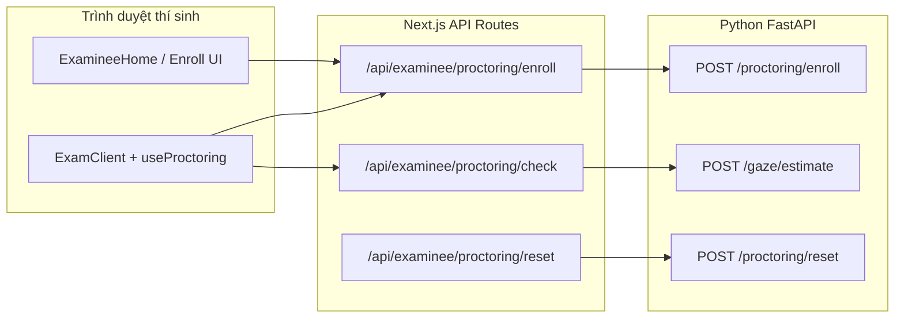
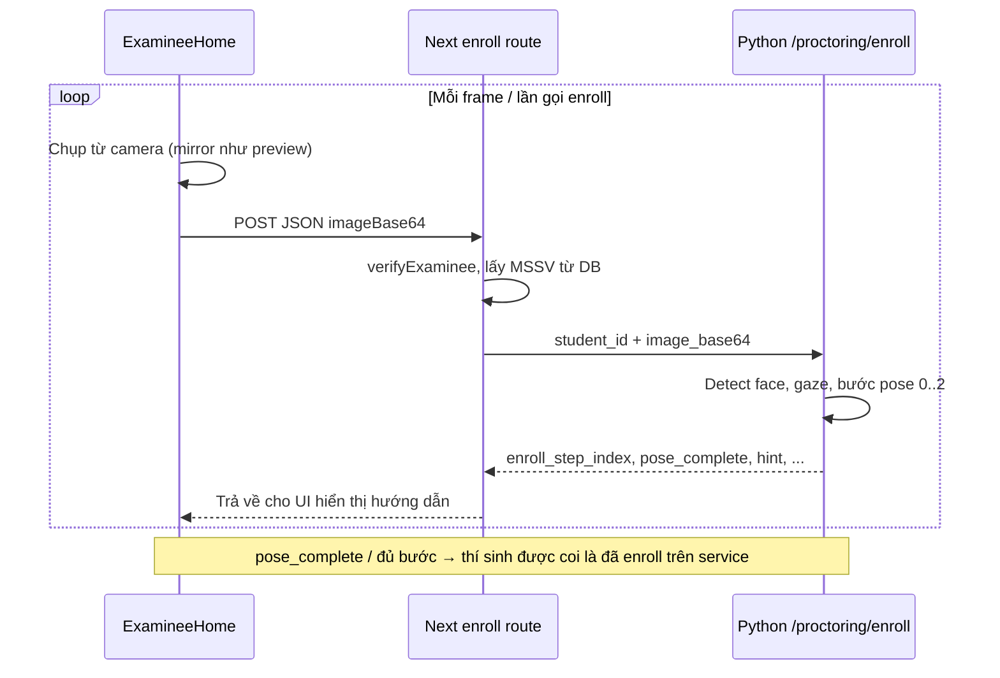
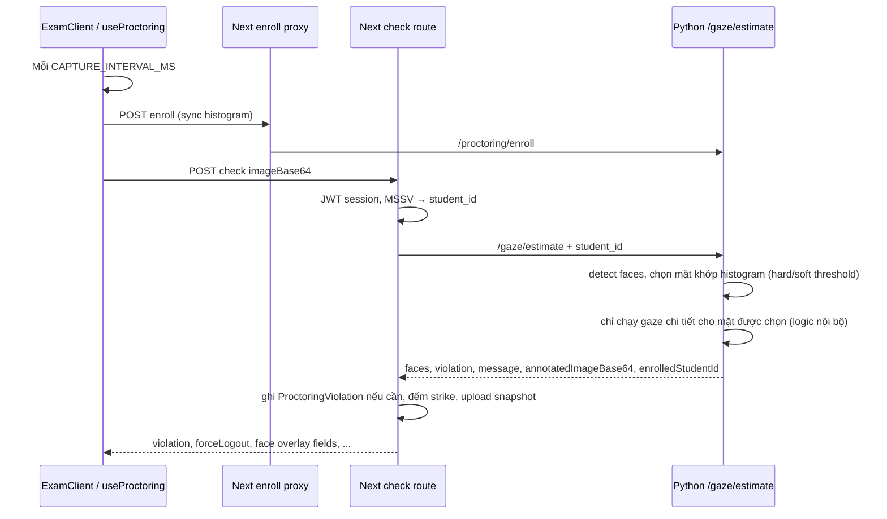

# Luồng định danh (enroll) và thi có giám sát

Tài liệu mô tả **luồng chính** giữa thí sinh (Next.js), API route examinee, và dịch vụ Python `service/api_server.py`. Chi tiết field JSON có thể khác theo từng phiên bản; khi sửa code hãy đối chiếu route và endpoint tương ứng.

## Tổng quan thành phần

---

## Luồng A — Trước khi vào thi: đăng ký khuôn mặt đa góc (enroll)

**Mục tiêu:** Thu 3 pose (chính diện → trái → phải), xác nhận gaze ổn định theo từng bước, lưu **histogram mặt** + gắn **MSSV** trên server Python cho phiên làm việc đó.

**Điểm cần nhớ**

- MSSV gửi sang Python là chuỗi từ bảng examinee, **không** dùng ID nội bộ số.
- Tiến trình enroll (bước 0..2) và histogram là **trạng thái in-memory** trên tiến trình uvicorn — restart service sẽ mất; client nên gọi enroll lại khi vào thi (xem luồng B).

---

## Luồng B — Trong bài thi: đồng bộ enroll + kiểm tra định kỳ

**Mục tiêu:** Định kỳ gửi khung hình từ camera; **đồng bộ lại** histogram lên server (ít nhất đến khi enroll HTTP thành công một lần trong phiên hook), rồi gọi **gaze estimate** để: khớp mặt với MSSV, phát hiện nhìn lệch, nhiều người, không có mặt, v.v.

**Định danh trên khung hình**

- Server so histogram crop mặt với `enrolled_hist` và kiểm tra owner MSSV khớp request.
- `enrolledStudentId` trong response chỉ có khi **khớp định danh** trong frame đó.
- Ảnh annotate: vẽ **bbox** cho mọi mặt phát hiện; **mũi tên gaze** chỉ vẽ cho mặt đã khớp định danh (tránh lộ hướng nhìn người chưa xác định).

**Vi phạm (khái niệm)**

- **Nhìn lệch** (looking away): cần duy trì đủ `PROCTORING_LOOKING_AWAY_MIN_SEC` (mặc định ~8s) theo logic server; mỗi “lượt” lệch có thể emit một lần kèm snapshot.
- **Không mặt / nhiều mặt:** cũng có dwell tương tự và kiểu violation riêng.
- App đếm số violation trong ca; vượt `PROCTORING_LOGOUT_AFTER_VIOLATIONS` → `forceLogout` và xử lý phía client (ví dụ đăng xuất).

---

## Luồng C — Reset / đăng xuất

- Route reset (và/hoặc logout) có thể gọi Python để **xóa trạng thái enroll** theo MSSV trên service (tránh dùng lại histogram của phiên cũ).
- `sessionStorage` phía client (ví dụ cờ đã enroll) chỉ mang tính UI; **nguồn sự thật** cho khớp mặt khi thi vẫn là dữ liệu trên Python sau khi gọi enroll thành công.

---

## Bảng endpoint tham chiếu nhanh

| Phía Next | Phía Python (gốc `PROCTORING_SERVICE_URL`) |
|-----------|---------------------------------------------|
| `POST /api/examinee/proctoring/enroll` | `POST /proctoring/enroll` |
| `POST /api/examinee/proctoring/check` | `POST /gaze/estimate` |
| `POST /api/examinee/proctoring/reset` | `POST /proctoring/reset` |

Cài đặt môi trường: [proctoring-setup.md](./proctoring-setup.md).
